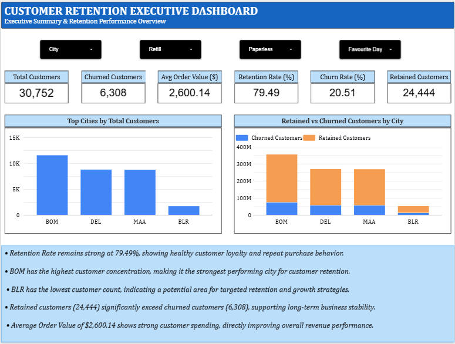
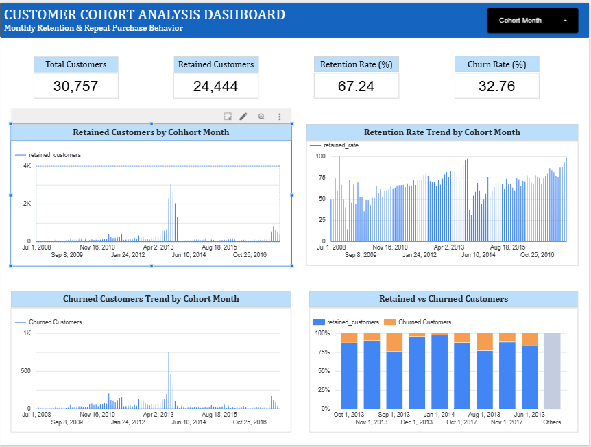
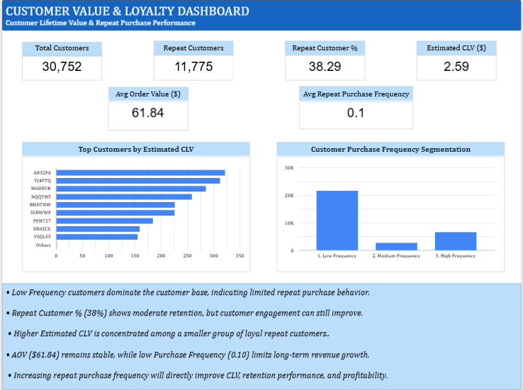

# Customer Retention & CLV Analytics Project

## Project Overview

This project focuses on analyzing customer retention, repeat purchase behavior, Customer Lifetime Value (CLV), and cohort performance using **dbt + BigQuery + Looker Studio**.

The objective is to transform raw customer transaction and engagement data into clean analytical marts and build executive dashboards for business decision-making.

---

## Tech Stack

* dbt (Data Build Tool)
* Google BigQuery
* Looker Studio
* SQL
* Git & GitHub
* VS Code

---

## Project Architecture

Raw Data → Staging Models → Mart Models → Dashboard Reporting

### Layers Used

### 1. Staging Layer

Cleaned and standardized raw customer retention data

**Model:**

* `stg_customer_retention.sql`

---

### 2. Mart Layer

Business-ready analytical models

**Models:**

* `repeat_customer_metrics.sql`
* `customer_lifetime_value.sql`
* `customer_retention_summary.sql`
* `monthly_cohort_analysis.sql`
* `executive_summary_dashboard.sql`

---

## Key Business Metrics

### Customer Retention Metrics

* Total Customers
* Repeat Customers
* Repeat Customer %
* Average Repeat Purchase Frequency

### Customer Value Metrics

* Average Order Value (AOV)
* Estimated Customer Lifetime Value (CLV)

### Cohort Metrics

* Monthly Retention Trends
* Customer Purchase Frequency Segmentation

---

## Dashboard Snapshots

### 1. Customer Retention Dashboard

Located in:



---

### 2. Customer Cohort Analysis Dashboard

Located in:



---

### 3. Customer Value & Loyalty Dashboard

Located in:



---

## Key Insights

* Low-frequency customers dominate the customer base
* Repeat customer percentage indicates moderate retention performance
* Higher CLV is concentrated among loyal repeat customers
* Average Order Value remains stable, but low purchase frequency limits long-term revenue growth
* Improving repeat purchases directly increases retention, CLV, and profitability

---

## Important Logic Used

### Repeat Customer Definition

```sql
order_frequency > 0
```

Customers with at least one completed repeat purchase are considered repeat customers.

This logic was validated through raw data debugging in BigQuery.

---

## How to Run

### Install dependencies

```bash
dbt deps
```

### Run models

```bash
dbt run
```

### Run tests

```bash
dbt test
```

---

## Security Note

Service account JSON keys and local dbt profile configurations are excluded using `.gitignore` and are not pushed to GitHub.

---

## Author

Built by Himanshu Gautam

Data Analyst | Data Engineering | Analytics Engineering | BI Development
